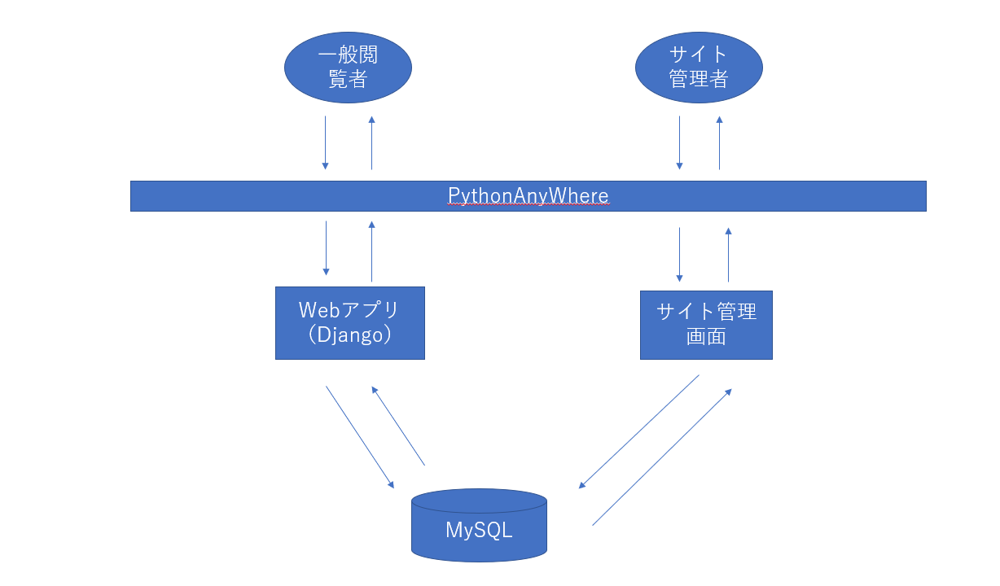

# 登録されている著書ごとに画像を閲覧することができるウェブアプリ

# 作成の動機
私の妹が、カテゴリーごとに画像をコメントなどを添えてHTMLでサイトurl:https://kasanefunk.github.io/kasanesworks/kasaneworks.japanese/index.html
を作っていたのですが、管理画面から画像やコメント等を登録できるようにしたいと言っていたことがきっかけで今回このようなウェブアプリを作ることになりました。

# 苦労したこと
・もともとはログイン画面やログアウト機能、画像やコメントの追加機能も自分でPythonやHTMLのコードを作っていたのですが、管理画面と非管理画面で分けずに非管理画面から管理画面へとレンダリングするやりかたですとセキュリティ上の問題があったために管理画面はdjangoのadminを使う形式に変えるためにコードを大幅に修正したこと。

# システム構成

## 矢印１

# 使用技術
・Python

・Django

・PostgreSQL

・MySQL

・Git

・HTML＆CSS

